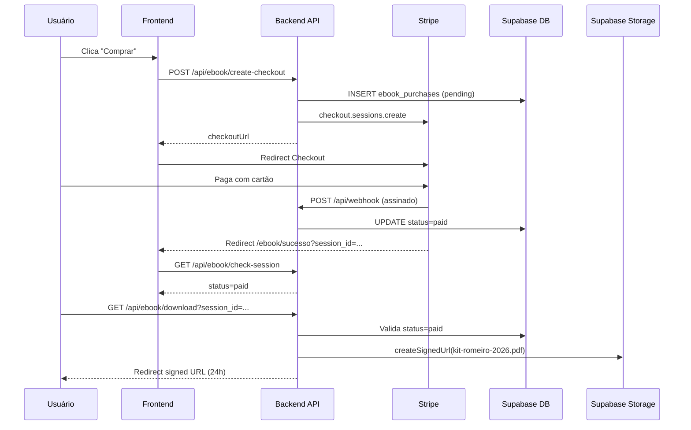

# Kit do Romeiro 2026 — Integração Stripe + Supabase

Fluxo ponta a ponta: **Landing → Stripe Checkout → Webhook → Supabase → Download seguro**.

## Arquitetura



## Configuração (.env)

### Frontend (`.env.local` ou `.env.production`)

```env
VITE_SUPABASE_URL=https://SEU_PROJETO.supabase.co
VITE_SUPABASE_PUBLISHABLE_KEY=sb_publishable_...
VITE_API_URL=https://aparecidadonortesp.com.br
```

### Backend (`server/.env`)

```env
SUPABASE_URL=https://SEU_PROJETO.supabase.co
SUPABASE_SECRET_KEY=sb_secret_...
STRIPE_SECRET_KEY=sk_live_...
STRIPE_WEBHOOK_SECRET=whsec_...
EBOOK_PRICE_CENTS=990
SUPABASE_EBOOKS_BUCKET=ebooks
FRONTEND_URL=https://aparecidadonortesp.com.br
```

> **Segurança:** nunca coloque `SUPABASE_SECRET_KEY` ou `STRIPE_SECRET_KEY` no frontend.

## Banco de dados

Migrations em `supabase/migrations/`:

| Arquivo | Conteúdo |
|---------|----------|
| `20260620000000_create_ebook_purchases.sql` | Tabela `ebook_purchases` + RLS |
| `20260620100000_ebook_storage_and_rls.sql` | Bucket `ebooks` privado + políticas |

### Tabela `ebook_purchases`

| Coluna | Tipo | Descrição |
|--------|------|-----------|
| `stripe_checkout_session_id` | text UNIQUE | ID da sessão Stripe |
| `status` | text | `pending` → `paid` → download liberado |
| `email` | text | E-mail do comprador (Stripe) |
| `amount_paid` | numeric | Valor em BRL |

RLS ativo: **anon/authenticated não têm acesso**. Apenas o backend (service role) lê/escreve.

## Supabase Storage

1. No Dashboard: **Storage → New bucket → `ebooks`** (privado)
2. Upload: `kit-romeiro-2026.pdf` na raiz do bucket
3. Ou aplique a migration `20260620100000_ebook_storage_and_rls.sql`

## Stripe Webhook

1. [Stripe Dashboard → Webhooks](https://dashboard.stripe.com/webhooks)
2. Endpoint: `https://aparecidadonortesp.com.br/api/webhook`
3. Eventos:
   - `checkout.session.completed`
   - `checkout.session.async_payment_succeeded` (Pix/boleto assíncrono)
4. Copie o **Signing secret** → `STRIPE_WEBHOOK_SECRET`

### Código do webhook (handler do Ebook)

`server/webhooks/stripeEbookHandler.js` — valida `metadata.type === 'ebook'` e `payment_status === 'paid'` antes de gravar `status = paid`.

O webhook principal em `server/index.js` (`POST /api/webhook`) valida a assinatura com:

```js
stripe.webhooks.constructEvent(req.body, sig, process.env.STRIPE_WEBHOOK_SECRET)
```

## API Backend

| Método | Rota | Descrição |
|--------|------|-----------|
| POST | `/api/ebook/create-checkout` | Cria sessão Stripe + registro pending |
| GET | `/api/ebook/check-session?session_id=` | Status para polling no frontend |
| GET | `/api/ebook/download?session_id=` | Valida pagamento + signed URL |

Implementação: `server/routes/ebook.js` + `server/services/ebookPurchaseService.js`

## Frontend

| Página | Rota | Função |
|--------|------|--------|
| Landing | `/kit-do-romeiro` | CTA de compra |
| Sucesso | `/ebook/sucesso` | Polling + botão download |
| Cancelado | `/ebook/cancelado` | Retorno se cancelar |

Cliente API: `src/lib/ebookApi.ts`

```ts
import { startEbookCheckout, checkEbookSession, getEbookDownloadUrl } from '../lib/ebookApi';

const url = await startEbookCheckout();
window.location.href = url;
```

## Teste local

```bash
# Terminal 1 — backend
cd server && npm run dev

# Terminal 2 — frontend
npm run dev

# Terminal 3 — Stripe CLI (webhook local)
stripe listen --forward-to localhost:3001/api/webhook
```

Use cartão de teste Stripe: `4242 4242 4242 4242`.

## Checklist de produção

- [ ] Migrations aplicadas no Supabase
- [ ] PDF `kit-romeiro-2026.pdf` no bucket `ebooks`
- [ ] Webhook Stripe apontando para `/api/webhook`
- [ ] Variáveis de ambiente no servidor e no build do frontend
- [ ] Teste de compra real ou modo teste end-to-end
