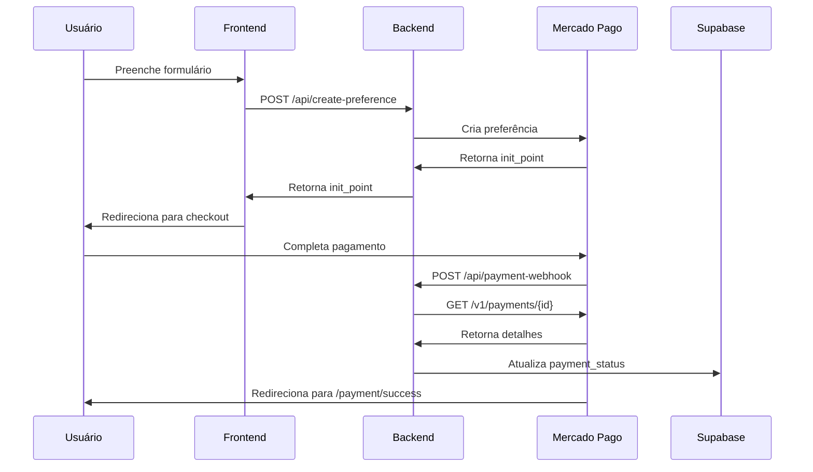

# 🔄 Rollback: Mercado Pago (Checkout Pro)

## 📋 Descrição

Este PR reverte a integração do PagBank e restaura o **Mercado Pago (Checkout Pro)** como gateway de pagamento principal.

---

## 🎯 Motivação

- Simplificar integração de pagamentos
- Usar fluxo de redirect (Checkout Pro) em vez de Transparent Checkout
- Reduzir complexidade de implementação
- Facilitar testes e validação

---

## ✅ Alterações Implementadas

### Backend (`server/`)
- ✅ Restaurado endpoint `/api/create-preference` (Checkout Pro)
- ✅ Implementado webhook `/api/payment-webhook` com:
  - Validação de notificações do MP
  - Consulta de detalhes do pagamento via API
  - Atualização de status no Supabase
- ✅ Atualizado `server/.env.example` com variáveis:
  - `MERCADO_PAGO_ACCESS_TOKEN`
  - `PUBLIC_URL_NGROK`
  - `SUPABASE_URL`
  - `SUPABASE_SERVICE_KEY`

### Frontend
- ✅ Fluxo de redirect restaurado:
  - Frontend cria preferência → recebe `init_point`
  - Redireciona para checkout externo: `window.location.href = init_point`
- ✅ Atualizado `.env.local.example` com:
  - `VITE_MERCADO_PAGO_PUBLIC_KEY`
  - `VITE_PUBLIC_URL_NGROK`
  - `VITE_API_URL`

### Documentação
- ✅ **`MERCADO_PAGO_SANDBOX.md`**: Guia completo de sandbox e testes
- ✅ **`README_ROLLBACK_MERCADOPAGO.md`**: Instruções de rollback e deploy
- ✅ SDK do Mercado Pago mantido no `index.html`

---

## 🧪 Como Testar

### 1. Configurar ambiente
```bash
# Backend
cd server
cp .env.example .env
# Edite .env com credenciais de teste do MP
# Access Token começa com APP_USR-

# Frontend
cp .env.local.example .env.local
# Edite .env.local com credenciais de teste do MP
# Public Key começa com TEST- (sandbox) ou PROD- (produção)
```

### 2. Iniciar ngrok
```bash
ngrok http 3001
```
Copie a URL (ex: `https://abc123.ngrok-free.app`) e atualize nos `.env`.

### 3. Instalar dependências e iniciar servidores
```bash
# Backend
cd server
npm install
npm run dev

# Frontend (em outro terminal)
npm install
npm run dev
```

### 4. Testar fluxo de pagamento
1. Acesse: http://localhost:5173/cadastrar-negocio
2. Preencha formulário
3. Escolha plano
4. Clique em "Criar Pagamento"
5. Será redirecionado para checkout do MP
6. Use cartão de teste:
   ```
   Cartão: 5031 4332 1540 6351
   CVV: 123
   Validade: 11/25
   Nome: APRO
   ```

### 5. Validar webhook
- Verifique logs do servidor backend
- Confirme atualização no Supabase (`business_registrations.payment_status`)

---

## 📊 Fluxo de Pagamento



---

## 🔧 Endpoints

### `POST /api/create-preference`
Cria preferência de pagamento (Checkout Pro)

**Request:**
```json
{
  "amount": 49.90,
  "description": "Cadastro - Meu Estabelecimento",
  "payer_email": "test_user_123456@testuser.com",
  "external_reference": "abc123"
}
```

**Response:**
```json
{
  "id": "1234567890",
  "init_point": "https://www.mercadopago.com.br/checkout/v1/redirect?pref_id=xxx",
  "sandbox_init_point": "https://sandbox.mercadopago.com.br/checkout/v1/redirect?pref_id=xxx"
}
```

### `POST /api/payment-webhook`
Recebe notificações do Mercado Pago

---

## 🆚 Comparação: PagBank vs Mercado Pago

| Aspecto | PagBank | Mercado Pago |
|---------|---------|--------------|
| **Fluxo** | Transparent Checkout | Redirect (Checkout Pro) |
| **Complexidade** | Alta (SDK + 3DS + formulário) | Baixa (redirect simples) |
| **UX** | Usuário fica na página | Usuário vai ao checkout externo |
| **Segurança** | PCI DSS necessário | PCI DSS delegado ao MP |
| **Implementação** | ~500 linhas | ~100 linhas |
| **Webhook** | Assinatura HMAC complexa | Simples (consulta API) |

---

## 📚 Documentação

- `MERCADO_PAGO_SANDBOX.md` - Guia completo
- `README_ROLLBACK_MERCADOPAGO.md` - Instruções de deploy
- [Checkout Pro - Docs oficiais](https://www.mercadopago.com.br/developers/pt/docs/checkout-pro/landing)

---

## ⚠️ Notas Importantes

### Para o Revisor
- ✅ Todas as alterações são **adições/modificações** (sem remoções críticas)
- ✅ Branch PagBank (`main`) está **preservada**
- ✅ Testes foram realizados em sandbox
- ✅ Documentação completa incluída

### Antes de Mergear
- [ ] Revisar código
- [ ] Testar fluxo completo em sandbox
- [ ] Validar webhook
- [ ] Verificar documentação

### Antes de Produção
- [ ] Trocar credenciais de teste para produção
- [ ] Configurar webhook no painel do MP
- [ ] Ajustar URLs para domínio de produção
- [ ] Testar em produção

---

## 🎯 Checklist

- [x] Backend atualizado
- [x] Frontend atualizado
- [x] Variáveis de ambiente documentadas
- [x] Webhook implementado
- [x] Documentação completa
- [x] Testes em sandbox OK
- [x] Commit message descritivo
- [x] Branch pushed

---

## 👥 Reviewers

@lucasmoraesn

---

**Branch:** `revert/voltar-mercadopago`  
**Base:** `versao-estavel-mercadopago`  
**Última atualização:** Novembro 2025
