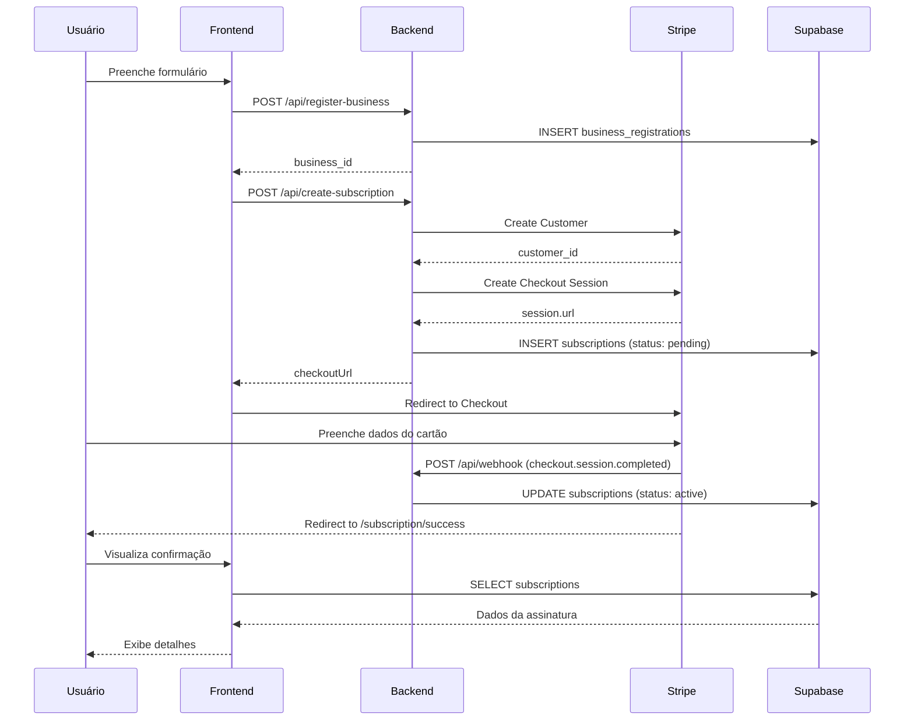

# 🎉 INTEGRAÇÃO STRIPE BILLING - CONCLUÍDA

## ✅ RESUMO DAS ALTERAÇÕES

### 📦 **Backend (server/)**

#### 1. Dependências
```bash
npm install stripe
```

#### 2. Arquivos Modificados

**server/index.js**
- ✅ Importado `Stripe` do pacote stripe
- ✅ Criado cliente Stripe com API version 2024-06-20
- ✅ Rota `/api/create-subscription` completamente reescrita:
  - Cria Stripe Customer
  - Cria Checkout Session (mode: 'subscription')
  - Salva subscription no Supabase com status 'pending'
  - Retorna `checkoutUrl` para o frontend
- ✅ Rota `/api/webhook` completamente reescrita:
  - Verifica assinatura com `STRIPE_WEBHOOK_SECRET`
  - Trata 4 eventos:
    - `checkout.session.completed` → Ativa assinatura
    - `customer.subscription.deleted` → Cancela assinatura
    - `invoice.payment_succeeded` → Registra pagamento
    - `invoice.payment_failed` → Registra falha

**server/.env.example**
- ✅ Adicionadas variáveis:
  - `STRIPE_SECRET_KEY=sk_test_...`
  - `STRIPE_WEBHOOK_SECRET=whsec_...`
  - `PUBLIC_URL_NGROK=https://...`

---

### 🎨 **Frontend (src/)**

#### 1. Arquivos Modificados

**src/lib/businessService.ts**
- ✅ Método `createSubscription()` atualizado:
  - Remove tratamento de erro 501
  - Retorna `{ checkoutUrl, subscriptionId }`
  - Valida resposta do servidor

**src/pages/SubscriptionSuccess.tsx**
- ✅ Alterado de `business_id` para `session_id`
- ✅ Busca assinatura por `stripe_checkout_session_id`
- ✅ Implementado polling para verificar atualização do webhook
- ✅ Melhorados logs de debug

**src/pages/SubscriptionCancel.tsx** (NOVO)
- ✅ Página criada para cancelamento do checkout
- ✅ Opção de tentar novamente ou voltar ao início
- ✅ Link para WhatsApp de suporte

**src/App.tsx**
- ✅ Adicionada rota `/subscription/cancel`
- ✅ Importado componente `SubscriptionCancel`

#### 2. Arquivos de Migração

**supabase/migrations/20250119000000_add_stripe_columns.sql** (NOVO)
- ✅ Adicionadas colunas:
  - `stripe_customer_id VARCHAR(255)`
  - `stripe_checkout_session_id VARCHAR(255)`
- ✅ Criados índices para performance
- ✅ Adicionados comentários de documentação

---

## 🔧 CONFIGURAÇÃO

### 1. Variáveis de Ambiente

Crie o arquivo `server/.env` com:

```env
# Supabase
SUPABASE_URL=https://seu-projeto.supabase.co
SUPABASE_SERVICE_KEY=eyJ...

# Stripe Billing
STRIPE_SECRET_KEY=sk_test_51...
STRIPE_WEBHOOK_SECRET=whsec_...

# URL pública (ngrok para desenvolvimento)
PUBLIC_URL_NGROK=https://seu-dominio.ngrok-free.app

# Servidor
PORT=3001
```

### 2. Obter Credenciais Stripe

1. Acesse: https://dashboard.stripe.com/test/apikeys
2. Copie a **Secret Key** (começa com `sk_test_`)
3. Cole em `STRIPE_SECRET_KEY`

### 3. Configurar Webhook

1. Acesse: https://dashboard.stripe.com/test/webhooks
2. Clique em **"Add endpoint"**
3. URL: `https://seu-dominio.ngrok-free.app/api/webhook`
4. Eventos para escutar:
   - ✅ `checkout.session.completed`
   - ✅ `customer.subscription.deleted`
   - ✅ `invoice.payment_succeeded`
   - ✅ `invoice.payment_failed`
5. Copie o **Signing secret** (começa com `whsec_`)
6. Cole em `STRIPE_WEBHOOK_SECRET`

### 4. Aplicar Migration no Supabase

Execute a migration no Supabase:

```sql
-- Cole o conteúdo de:
-- supabase/migrations/20250119000000_add_stripe_columns.sql
```

Ou use a CLI do Supabase:
```bash
supabase migration up
```

---

## 🧪 TESTES

### 1. Iniciar Servidor Backend

```bash
cd server
npm start
```

Você deve ver:
```
✅ Supabase client created
✅ Stripe client created
🚀 Server on http://localhost:3001
💳 Stripe Billing integrado e ativo
   Webhook endpoint: http://localhost:3001/api/webhook
```

### 2. Iniciar ngrok (para webhooks)

```bash
ngrok http 3001
```

Copie a URL gerada (ex: `https://abc123.ngrok-free.app`) e:
1. Atualize `PUBLIC_URL_NGROK` no `.env`
2. Configure no webhook do Stripe

### 3. Iniciar Frontend

```bash
npm run dev
```

### 4. Testar Fluxo Completo

1. **Acessar cadastro:** http://localhost:5173/cadastrar-negocio
2. **Preencher formulário:**
   - Nome do estabelecimento
   - Categoria
   - Endereço
   - Mínimo 3 fotos
   - WhatsApp
   - Descrição
   - **Escolher plano**
   - **E-mail para pagamento**
   - Aceitar termos
3. **Clicar em "Cadastrar"**
4. **Redirecionar para Stripe Checkout**
5. **Testar com cartão de teste:**
   - Número: `4242 4242 4242 4242`
   - Data: Qualquer data futura
   - CVV: Qualquer 3 dígitos
   - CEP: Qualquer 5 dígitos
6. **Confirmar pagamento**
7. **Redirecionar para `/subscription/success`**
8. **Verificar webhook no console do servidor**

### 5. Verificar no Stripe Dashboard

1. Acesse: https://dashboard.stripe.com/test/customers
2. Verifique se o cliente foi criado
3. Acesse: https://dashboard.stripe.com/test/subscriptions
4. Verifique se a assinatura está ativa

### 6. Verificar no Supabase

```sql
-- Ver assinaturas criadas
SELECT * FROM subscriptions ORDER BY created_at DESC;

-- Ver pagamentos registrados
SELECT * FROM payments ORDER BY created_at DESC;
```

---

## 🔍 DEBUGGING

### Logs Importantes

**Backend (Terminal do servidor):**
```
📥 Criando assinatura Stripe: {...}
✅ Plano encontrado: Básico - R$ 49.9
🔵 Criando Stripe Customer...
✅ Stripe Customer criado: cus_...
🔵 Criando Stripe Checkout Session...
✅ Checkout Session criada: cs_...
✅ Assinatura salva no Supabase: 123
```

**Webhook (Terminal do servidor):**
```
✅ Webhook verificado: checkout.session.completed
📦 checkout.session.completed: cs_...
✅ Assinatura encontrada: 123
✅ Assinatura 123 ATIVADA
```

**Frontend (Console do navegador - F12):**
```
📤 Criando assinatura Stripe: {...}
✅ Assinatura criada com sucesso: {...}
🔗 Redirecionando para checkout de pagamento: https://checkout.stripe.com/...
```

### Problemas Comuns

#### ❌ "Webhook Error: No signatures found"
**Solução:** Verifique se `STRIPE_WEBHOOK_SECRET` está configurado corretamente

#### ❌ "URL de checkout não retornada"
**Solução:** Verifique se `STRIPE_SECRET_KEY` está válida

#### ❌ "Assinatura não encontrada"
**Solução:** Aguarde alguns segundos para o webhook processar

#### ❌ Build falha com erro de TypeScript
**Solução:** Execute `npm run build` na raiz do projeto

---

## 📊 FLUXO COMPLETO



---

## 🎯 PRÓXIMOS PASSOS (OPCIONAL)

### 1. Upload Real de Fotos
- Integrar com Cloudinary/AWS S3
- Substituir URLs mock por URLs reais

### 2. E-mails Transacionais
- SendGrid ou AWS SES
- E-mail de confirmação de cadastro
- E-mail de pagamento aprovado

### 3. Portal do Cliente Stripe
- Permitir que usuários gerenciem suas assinaturas
- Atualizar forma de pagamento
- Visualizar histórico de faturas
- Cancelar assinatura

### 4. Ambiente de Produção
- Trocar chaves de teste por chaves de produção
- Configurar domínio próprio (remover ngrok)
- Configurar SSL/TLS
- Monitoramento de erros (Sentry)

---

## ✅ CHECKLIST DE DEPLOY

- [ ] Variáveis de ambiente configuradas no servidor de produção
- [ ] Webhook configurado com URL de produção
- [ ] Chaves do Stripe trocadas de test para live
- [ ] Migrations aplicadas no Supabase de produção
- [ ] Frontend buildado e deployado
- [ ] Backend deployado e rodando
- [ ] Testes de ponta a ponta realizados
- [ ] Monitoramento de erros configurado
- [ ] Backup do banco de dados configurado

---

**🎉 Integração Stripe Billing concluída com sucesso!**

**Desenvolvido em:** 19 de Janeiro de 2025
**Versão:** 1.0.0
